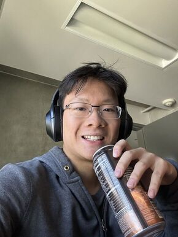

# Welcome to My User Page

#### Hi! My name is **Owen** and I am an aspiring software engineer.



## More About Me
I am currently a second year computer science student studying at the University of California, San Diego [(UCSD)](https://ucsd.edu/). For those interested, a list of the courses I've taken so far can be found [here](#relevant-courses). In my free time I enjoy cooking, working out, trading stocks, and tinkering with mechanical keyboards. I've also just recently taken up hiking and rock climbing, which have been quite challenging!

## Status:
- [x] Working on projects
- [x] Looking for internship/work
- [ ] Hired
- [ ] Retired 

## Technical Skills
Below is a list of all the languages and technologies I am <span style="color:green">**currently proficient**</span> in:
```
Python
Java
C
C++
ARM Assembly
HTML/CSS
P̶s̶e̶u̶d̶o̶c̶o̶d̶e̶
```
Below is a list of all the languages and technologies I am <span style="color:red"> **currently learning**</span>:
```
Javascript
Postman
PostgreSQL
SQL
```
## Courses Completed
**Programming**
1. ENG 10
2. CSE 8A
3. CSE 11
4. CSE 12
5. CSE 15L
6. CSE 30
7. CSE 100

**Theory/Math**
1. CSE 20
2. CSE 21
3. CSE 105

## Coursework/Projects
### Phone Detox Box
#### Class Project for ENG 10
- Wrote Python code to control a timed lock for use in a 3D printed enclosure large enough to fit a phone.
- Developed using Mu Editor and the CircuitPython library
- Viewable [here](https://docs.google.com/presentation/d/1HtKVZlr-B5zssX9Jq5KmkdkVGgsZZVri27mfivBaMvQ/edit#slide=id.g1f925baa7c4_0_30)

### Huffman Tree Encoding
#### Class Project for CSE 100
- Developed a command line program to encode/decode any file using lossless Huffman Encoding
- *<span style="color:red"> Code available upon request </span>*

### In Memory Database
#### Programming Assignment for CSE 30
- Developed an in memory database of NYC traffic violation tickets
- *<span style="color:red"> Code available upon request </span>*

## Contact Me
>You can reach me through:
>* Email: ohuynh@ucsd.edu
>* Discord: [OwenH#5114](discord.gg)
>* Instagram: [@owen_h.2021](https://www.instagram.com/owen_h.2021/?next=%2F)

[Where does this take me?](/page.md)